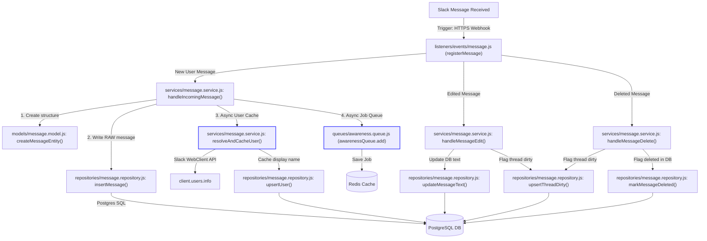
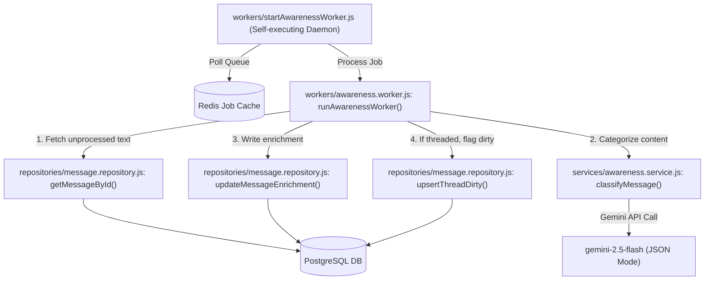
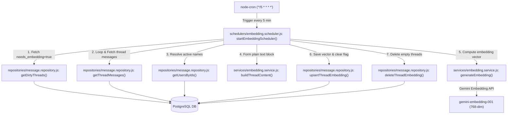

# MemGo Slack Bot — Architecture Flow Map & Complete Project Catalog

This document is a technical audit of the **MemGo Slack Bot** codebase. It maps out every file in the project, details their exported functions, internal call chains, triggers, external service dependencies, and illustrates the structured flow of data across different architectural boundaries.

---

## 🗺️ High-Level System Architecture

The MemGo bot is structured around a decoupled, multi-tier layout:
1. **Trigger & Listener Layer**: Captures events (Slack Webhooks for messages, mentions, and commands).
2. **Business Services Layer**: Coordinates domain operations (RAG, summarization, vector database indexing, security checks, context sessioning).
3. **Queues & Background Workers Layer**: Defers compute-heavy tasks (AI categorization, vector calculations) using Redis-backed queues and scheduling crons.
4. **Data Repository Layer**: Centralizes all SQL statements and isolates Supabase/PostgreSQL schema operations.
5. **Models Layer**: Transforms raw JSON web payloads into structured data models.

```
       [ Slack Event Hook ]                   [ Slack Command /memory ]
                │                                         │
        ┌───────▼────────────────────────┐        ┌───────▼────────────────────────┐
        │  listeners/events/message.js   │        │ listeners/commands/memory.js   │
        └───────┬────────────────────────┘        └───────┬────────────────────────┘
                │ (async/non-blocking)                    │ (RAG / Search / Summarize)
        ┌───────▼────────────────────────┐                │
        │   services/message.service.js  │        ┌───────▼────────────────────────┐
        └───────┬──────────────┬─────────┘        │     services/rag.service.js    │
                │              │                  │     services/search.service.js │
        ┌───────▼─────┐  ┌─────▼─────────┐        │     services/summary.service.js│
        │ insertMessage│  │  BullMQ Queue │        └───────┬──────────────────┬─────┘
        └───────┬─────┘  └─────┬─────────┘                │                  │
                │              │ (async/non-blocking)     │ (Vector embed)   │ (SQL Gated)
        ┌───────▼─────┐  ┌─────▼─────────┐        ┌───────▼─────────┐  ┌─────▼─────────────┐
        │ PostgreSQL  │  │ Redis (Queue) │        │ Gemini API (AI) │  │message.repository │
        └─────────────┘  └─────┬─────────┘        └─────────────────┘  └─────┬─────────────┘
                               │                                             │ (pgvector cosine)
                         ┌─────▼─────────┐                             ┌─────▼─────────────┐
                         │ BullMQ Worker │                             │   PostgreSQL DB   │
                         └─────┬─────────┘                             └───────────────────┘
                               │ (Gemini classification)
                         ┌─────▼──────────────┐
                         │  awareness.worker  │
                         └────────────────────┘
```

---

## 1️⃣ Layered Call Chains & Flow Trees

Here are the interactive data flows representing the ingestion pipelines, worker executions, and command invocations.

### A. Real-Time Message Ingestion & Background Enrichment Flow
When a user posts a message, it is saved immediately, while AI classification and name caches are handled in parallel in an asynchronous, non-blocking fashion.



### B. BullMQ Asynchronous Awareness Worker Pipeline
The BullMQ worker runs as a background process, consuming classification jobs generated by message ingestion.



### C. The 5-Minute Embedding Scheduler Cron
A lightweight cron job checks the database for dirty threads and calculates their updated embeddings in a bulk process.



### D. `/memory` Slash Command Interactions
The user controls memory queries, decisions, updates, and indexing requests synchronously from the Slack command interface.

```mermaid
graph TD
    UserCommand["User inputs: /memory <subcommand>"] -->|Slack Trigger| CommandListener["listeners/commands/memory.js (registerMemoryCommand)"]
    CommandListener -->|Immediate Acknowledge| SlackAck["ack()"]
    
    %% RAG ASK FLOW
    CommandListener -->|'ask <question>'| AskService["services/rag.service.js: answerFromMemory()"]
    AskService -->|Context fetch| GetContext["services/context.service.js: getContextForCommand()"]
    GetContext --> Postgres[(PostgreSQL DB)]
    
    AskService -->|Membership check| MemberCheck["services/membership.service.js: resolveAccessibleChannels()"]
    MemberCheck -->|Is cached?| CacheCheck["repositories/message.repository.js: isMembershipStale()"]
    MemberCheck -->|No: Sync Slack API| SlackConversations["client.users.conversations"]
    MemberCheck -->|Save membership| RepoSaveMembership["repositories/message.repository.js: upsertUserChannels()"]
    MemberCheck -->|Fetch accessible| RepoGetMembership["repositories/message.repository.js: getAccessibleChannels()"]
    
    AskService -->|Compute Query Vector| GeminiEmbed["services/embedding.service.js: generateEmbedding()"]
    GeminiEmbed -->|Gemini Embedding| EmbedSDK["gemini-embedding-001 (768-dim)"]
    
    AskService -->|Channel-gated vector query| RepoSearchThreads["repositories/message.repository.js: searchThreads()"]
    RepoSearchThreads --> Postgres
    
    AskService -->|Formulate prompt & QA| GeminiQA["gemini-2.5-flash"]
    AskService -->|Async Audit Log| LogInteraction["services/context.service.js: logInteraction()"]
    LogInteraction --> Postgres
    
    %% HYBRID SEARCH FLOW
    CommandListener -->|'search <query>'| SearchService["services/search.service.js: searchMemory()"]
    SearchService --> GetContext
    SearchService --> MemberCheck
    SearchService --> GeminiEmbed
    SearchService -->|Vector + Keyword match| RepoSearchHybrid["repositories/message.repository.js: searchHybrid()"]
    RepoSearchHybrid --> Postgres
    SearchService --> LogInteraction
    
    %% SUMMARIZE FLOW
    CommandListener -->|'summarize'| SummaryService["services/summary.service.js: summarizeChannel()"]
    SummaryService --> GetContext
    SummaryService -->|Get last 7 days text| RepoGetSummary["repositories/message.repository.js: getSummaryMessages()"]
    RepoGetSummary --> Postgres
    SummaryService -->|Summarize channel| GeminiQA
    SummaryService --> LogInteraction
    
    %% DECISIONS FLOW
    CommandListener -->|'decisions'| RepoGetDecisions["repositories/message.repository.js: getDecisions()"]
    RepoGetDecisions --> Postgres
    CommandListener --> LogInteraction
    
    %% SAVE THREAD/CHANNEL FLOW
    CommandListener -->|'save <url>'| SaveThread["services/save.service.js: saveThread()"]
    SaveThread --> MemberCheck
    SaveThread --> RepoGetThread
    SaveThread --> RepoGetUsers
    SaveThread --> ServiceBuild
    SaveThread --> ServiceEmbed
    SaveThread --> RepoUpsertEmbed
    
    CommandListener -->|'save' (no url)| SaveChannel["services/save.service.js: saveChannel()"]
    SaveChannel --> MemberCheck
    SaveChannel -->|Fetch last 30 mins| RepoGetRecent["repositories/message.repository.js: getRecentChannelMessages()"]
    RepoGetRecent --> Postgres
    SaveChannel --> Group["Group messages into threads"]
    Group --> RepoGetUsers
    Group --> ServiceBuild
    Group --> ServiceEmbed
    Group --> RepoUpsertEmbed
```

---

## 2️⃣ Comprehensive File-by-File Technical Directory

A exhaustive file mapping with signatures, logic, internal call hierarchies, and direct external service connections.

### Root Directory

#### `index.js`
*   **Layer**: Main Entry Point
*   **Exported Functions**: None
*   **Triggers / Event Listeners**: Runs on application boot
*   **Call Chain / Core Logic**:
    *   Imports `app` and `config` from `src/app.js`.
    *   Imports `pool` from `src/config/database.js`.
    *   Imports `startEmbeddingScheduler` from `src/schedulers/embedding.scheduler.js`.
    *   Performs database connection sanity check (`await pool.query("SELECT 1")`) (**blocking**).
    *   Starts the Slack app server (`await app.start(config.port)`) (**blocking**).
    *   Triggers the embedding cron job scheduler (`startEmbeddingScheduler()`) (**async / non-blocking**).
*   **External Services Touched**: PostgreSQL (connection test), Slack HTTP Port.

#### `debug.js`
*   **Layer**: Utility Scripts
*   **Exported Functions**: None (Executed as standalone utility: `node debug.js`)
*   **Triggers / Event Listeners**: Executed manually during testing
*   **Call Chain / Core Logic**:
    *   Queries `messages` database table for entries having `user_id` without matching `users` records (**blocking**).
    *   For each unique missing user:
        *   Retrieves real name and display configurations from Slack API (`client.users.info`) (**blocking**).
        *   Upserts names to user cache via `upsertUser()` from `message.repository.js` (**blocking**).
*   **External Services Touched**: Slack API (`users.info`), PostgreSQL (write operations).

---

### `src/config/` (Configuration Layer)

#### `src/config/database.js`
*   **Layer**: Configuration
*   **Exported Functions**: `default` (Instance of `pg.Pool`)
*   **Triggers / Event Listeners**: Initiated on module load
*   **Call Chain / Core Logic**:
    *   Initializes PostgreSQL client connection pool using `DATABASE_URL`.
    *   Configures pool parameters: SSL authorized, 15-second connect timeout, 15-second query execution ceiling.
    *   Logs connection events (`pool.on("connect")`) and connection failures (`pool.on("error")`).
*   **External Services Touched**: PostgreSQL.

#### `src/config/environment.js`
*   **Layer**: Configuration
*   **Exported Functions**: `config` (Parsed configurations object)
*   **Triggers / Event Listeners**: Runs on module import
*   **Call Chain / Core Logic**:
    *   Checks for the existence of required environment variables: `SLACK_BOT_TOKEN`, `SLACK_SIGNING_SECRET`, `GEMINI_API_KEY`, `REDIS_URL`, `DATABASE_URL`.
    *   Throws descriptive startup error if any key is missing.
    *   Parses port defaults (`PORT` or fallback to `4390`).
*   **External Services Touched**: Node Process Environment.

---

### `src/middleware/` (Server Middleware Layer)

#### `src/middleware/logger.middleware.js`
*   **Layer**: Middleware
*   **Exported Functions**: `loggerMiddleware({ body, next })`
*   **Triggers / Event Listeners**: Intercepts every incoming Slack Webhook event
*   **Call Chain / Core Logic**:
    *   Captures timestamp, event payload type, trigger channel, trigger user, and message preview.
    *   Logs formatting data into standard console output stream.
    *   Yields execution to downstream handlers using `await next()`.
*   **External Services Touched**: Standard console stdout.

---

### `src/utils/` (Utility Layer)

#### `src/utils/text.utils.js`
*   **Layer**: Utilities
*   **Exported Functions**:
    *   `truncateText(text, maxLength = 100)`: Safely cuts string to size and appends ellipsis.
    *   `truncateForSlack(text, limit = 2900)`: Specialized Slack truncation utility. Leaves safe margin below Slack's strict 3,000-character block size limits and adds standard footer notice.
*   **Triggers / Event Listeners**: None
*   **Call Chain / Core Logic**: Pure text truncation utility functions.
*   **External Services Touched**: None.

---

### `src/models/` (Data Model Layer)

#### `src/models/message.model.js`
*   **Layer**: Models
*   **Exported Functions**: `createMessageEntity(event, body)`
*   **Triggers / Event Listeners**: Called inside message handler pipelines
*   **Call Chain / Core Logic**:
    *   Accepts raw Slack payload body and event.
    *   Maps payload properties into standardized DB schemas (isolates workspace, channel IDs, user tags, timestamps, text bodies, payloads).
*   **External Services Touched**: None.

---

### `src/listeners/` (Trigger & Event Hook Layer)

#### `src/listeners/index.js`
*   **Layer**: Listeners Root
*   **Exported Functions**: `registerListeners(app)`
*   **Triggers / Event Listeners**: Runs during main application bootstrap
*   **Call Chain / Core Logic**:
    *   Calls `registerAppMention(app)` from `./events/app-mention.js`.
    *   Calls `registerMessage(app)` from `./events/message.js`.
    *   Calls `registerMemoryCommand(app)` from `./commands/memory.js`.
*   **External Services Touched**: Slack Bolt application instance registration.

#### `src/listeners/events/app-mention.js`
*   **Layer**: Event Handlers
*   **Exported Functions**: `registerAppMention(app)`
*   **Triggers / Event Listeners**: Triggers when the bot is tagged in a chat (`app_mention`)
*   **Call Chain / Core Logic**:
    *   Listens for `app_mention` webhook trigger.
    *   Executes asynchronous, non-blocking call: `await say("👋 I'm alive!")`.
*   **External Services Touched**: Slack Web API (`say` helper).

#### `src/listeners/events/message.js`
*   **Layer**: Event Handlers
*   **Exported Functions**: `registerMessage(app)`
*   **Triggers / Event Listeners**: Triggers on any channel activity event (`message`)
*   **Call Chain / Core Logic**:
    *   Filters out messages originating from bots (`event.bot_id`).
    *   Routes message events based on webhook subtype triggers:
        *   `event.subtype === "message_changed"` (Edit): calls `handleMessageEdit(event, body)` (**blocking downstream**).
        *   `event.subtype === "message_deleted"` (Delete): calls `handleMessageDelete(event, body)` (**blocking downstream**).
        *   No subtype (New Message): calls `handleIncomingMessage(event, body, client)` (**blocking downstream**).
*   **External Services Touched**: PostgreSQL, Redis Queue (triggered downstream inside message services).

#### `src/listeners/commands/memory.js`
*   **Layer**: Command Handlers
*   **Exported Functions**: `registerMemoryCommand(app)`
*   **Triggers / Event Listeners**: Triggers when a user invokes `/memory <subcommand>` slash command
*   **Call Chain / Core Logic**:
    *   Acknowledges webhook trigger immediately using `await ack()`.
    *   Splits user command inputs into `subcommand` and `query` variables.
    *   Matches subcommand trigger configurations:
        *   **`ask`**: Replies with loading status $\rightarrow$ calls `answerFromMemory()` from `rag.service.js` $\rightarrow$ responds to user with output blocks.
        *   **`decisions`**: Replies with loading status $\rightarrow$ calls `getDecisions()` from `message.repository.js` $\rightarrow$ parses lists $\rightarrow$ logs execution in background via `logInteraction()` from `context.service.js` (**non-blocking**).
        *   **`summarize`**: Replies with loading status $\rightarrow$ calls `summarizeChannel()` from `summary.service.js` $\rightarrow$ checks truncation $\rightarrow$ posts public summary $\rightarrow$ triggers private user backup via `client.chat.postEphemeral` if truncated.
        *   **`search`**: Replies with loading status $\rightarrow$ calls `searchMemory()` from `search.service.js` $\rightarrow$ displays deep-linked results.
        *   **`save`**: Recognizes link inputs:
            *   *With Slack URL*: calls `saveThread()` from `save.service.js`.
            *   *Without URL*: calls `saveChannel()` from `save.service.js`.
*   **External Services Touched**: Slack Web API (`respond`, `chat.postEphemeral`), PostgreSQL, Gemini API.

---

### `src/services/` (Core Business Logic Layer)

#### `src/services/message.service.js`
*   **Layer**: Services
*   **Exported Functions**:
    *   `handleIncomingMessage(event, body, client)`:
        *   Blocks execution if message originates from a private DM channel (`im`/`mpim`).
        *   Transforms raw payload to DB model using `createMessageEntity()`.
        *   Inserts record using `insertMessage()` (**blocking DB call**).
        *   Resolves user profiles in background via helper `resolveAndCacheUser()` (**async / non-blocking**).
        *   Enqueues enrichment job: `awarenessQueue.add("classify", { messageId })` (**async / non-blocking**).
    *   `handleMessageEdit(event, body)`:
        *   Calls `updateMessageText()` (**blocking DB call**).
        *   Flags parent thread dirty: `upsertThreadDirty()` (**blocking DB call**).
    *   `handleMessageDelete(event, body)`:
        *   Calls `markMessageDeleted()` (**blocking DB call**).
        *   Flags parent thread dirty: `upsertThreadDirty()` (**blocking DB call**).
*   **Internal Functions**:
    *   `resolveAndCacheUser(client, workspaceId, userId)`: Fetches profile configurations via `client.users.info` $\rightarrow$ commits cache using `upsertUser()`.
*   **External Services Touched**: Slack API (`users.info`), PostgreSQL, Redis Queue (`awarenessQueue`).

#### `src/services/awareness.service.js`
*   **Layer**: Services
*   **Exported Functions**: `classifyMessage(text)`
*   **Triggers / Event Listeners**: Executed inside background queue processing worker
*   **Call Chain / Core Logic**:
    *   Performs early return if string text is shorter than 3 characters.
    *   Formulates a strict JSON-forcing categorization prompt instruction.
    *   Sends request to AI using Google Gen AI SDK: `genAI.models.generateContent({ model: "gemini-2.5-flash", contents })`.
    *   Strips formatting artifacts (like markdown ` ```json ` blocks) from model responses.
    *   Parses string using `JSON.parse()` and returns attributes map.
    *   Returns default categorization mapping on execution error (resilient architecture).
*   **External Services Touched**: Gemini API (`gemini-2.5-flash`).

#### `src/services/embedding.service.js`
*   **Layer**: Services
*   **Exported Functions**:
    *   `buildThreadContent(messages, usersMap = {})`: Loops over thread message arrays, replaces user IDs with cached display names, appends human-readable dates, and merges them into one formatted plaintext block.
    *   `generateEmbedding(content)`: Generates high-dimensional vector embeddings using Gemini SDK: `genAI.models.embedContent({ model: "gemini-embedding-001", contents })` (**blocking**).
*   **Triggers / Event Listeners**: None
*   **External Services Touched**: Gemini API (`gemini-embedding-001`).

#### `src/services/rag.service.js`
*   **Layer**: Services
*   **Exported Functions**: `answerFromMemory(workspaceId, userId, channelId, question, client)`
*   **Triggers / Event Listeners**: Triggered by `/memory ask` slash command
*   **Call Chain / Core Logic**:
    *   Retrieves session logs using `getContextForCommand()` from `context.service.js` (**blocking**).
    *   Resolves accessible channel list using `resolveAccessibleChannels()` from `membership.service.js` (**blocking**).
    *   Returns fallback notice immediately if the user is not present in any channels.
    *   Converts query question to vector via `genAI.models.embedContent` (**blocking**).
    *   Runs cosine similarity lookup gated by channel permissions using `searchThreads()` from `message.repository.js` (**blocking**).
    *   Extracts already-used threads from prior session context, deduplicating them against vector query results.
    *   Builds prompt combining user profile history, vector context, timeline reasoning guidelines, and target query.
    *   Triggers generation request: `genAI.models.generateContent({ model: "gemini-2.5-flash", contents })` (**blocking**).
    *   Persists audit records using `logInteraction()` from `context.service.js` (**async / non-blocking**).
*   **External Services Touched**: Gemini API (`gemini-embedding-001`, `gemini-2.5-flash`), PostgreSQL (read and write operations).

#### `src/services/summary.service.js`
*   **Layer**: Services
*   **Exported Functions**: `summarizeChannel(workspaceId, userId, channelId, client)`
*   **Triggers / Event Listeners**: Triggered by `/memory summarize` slash command
*   **Call Chain / Core Logic**:
    *   Computes epoch boundaries for target date range (past 7 days).
    *   Fetches session context: `getContextForCommand()` from `context.service.js` (**blocking**).
    *   Fetches message arrays: `getSummaryMessages()` from `message.repository.js` (**blocking**).
    *   Constructs a summary prompt with temporal reasoning instructions (reframing deadlines, dates, and overdue tasks).
    *   Calls Gemini to summarize: `genAI.models.generateContent({ model: "gemini-2.5-flash", contents })` (**blocking**).
    *   Saves interaction logs in background via `logInteraction()` (**async / non-blocking**).
*   **External Services Touched**: Gemini API (`gemini-2.5-flash`), PostgreSQL (read and write operations).

#### `src/services/search.service.js`
*   **Layer**: Services
*   **Exported Functions**: `searchMemory(workspaceId, userId, channelId, query, client)`
*   **Triggers / Event Listeners**: Triggered by `/memory search` slash command
*   **Call Chain / Core Logic**:
    *   Fetches session context: `getContextForCommand()` from `context.service.js` (**blocking**).
    *   Resolves accessible channels list: `resolveAccessibleChannels()` from `membership.service.js` (**blocking**).
    *   Generates query vector embedding: `genAI.models.embedContent` (**blocking**).
    *   Performs dual-mode search using `searchHybrid()` from `message.repository.js` (**blocking**).
    *   Maps result datasets to matching percentages and Slack archive URLs.
    *   Saves query logs in background via `logInteraction()` (**async / non-blocking**).
*   **External Services Touched**: Gemini API (`gemini-embedding-001`), PostgreSQL (read and write operations).

#### `src/services/membership.service.js`
*   **Layer**: Services
*   **Exported Functions**: `resolveAccessibleChannels(client, workspaceId, userId)`
*   **Triggers / Event Listeners**: Instigated by secure search/RAG execution gates
*   **Call Chain / Core Logic**:
    *   Queries membership stale state: `isMembershipStale()` from `message.repository.js` (**blocking**).
    *   If cache is valid: Fetches cached IDs from DB using `getAccessibleChannels()` and returns them (**blocking**).
    *   If cache is stale (>10 min): Triggers private syncing helper `syncUserChannels()` (**blocking**).
*   **Internal Functions**:
    *   `syncUserChannels(client, workspaceId, userId)`:
        *   Iteratively queries user channels from Slack API (`client.users.conversations`) to handle pagination.
        *   Upserts updated membership mapping to DB using `upsertUserChannels()`.
        *   Returns active channel ID array.
*   **External Services Touched**: Slack API (`users.conversations`), PostgreSQL (cache lookups and updates).

#### `src/services/save.service.js`
*   **Layer**: Services
*   **Exported Functions**:
    *   `saveThread(workspaceId, userId, url, client)`:
        *   Parses Slack channel ID and timestamp from link string.
        *   Resolves user access permissions via `resolveAccessibleChannels()`.
        *   Fetches matching messages from DB via `getThreadMessages()`.
        *   Fetches user display names via `getUsersByIds()`.
        *   Builds text block and creates vector via `buildThreadContent()` and `generateEmbedding()`.
        *   Saves embedding directly, resetting the dirty flag using `upsertThreadEmbedding()`.
    *   `saveChannel(workspaceId, userId, channelId, client)`:
        *   Checks user access permissions via `resolveAccessibleChannels()`.
        *   Fetches channel messages from the last 30 minutes via `getRecentChannelMessages()`.
        *   Groups messages into thread sets.
        *   For each thread set:
            *   Resolves display names, builds text block, generates vector embedding, and commits to DB via `upsertThreadEmbedding()`.
*   **Internal Functions**:
    *   `parseSlackUrl(url)`: Extracts channel ID and thread timestamp (`thread_ts`) from matching URL formats.
*   **External Services Touched**: Gemini API (`gemini-embedding-001`), PostgreSQL.

#### `src/services/context.service.js`
*   **Layer**: Services
*   **Exported Functions**:
    *   `getContextForCommand(workspaceId, userId, channelId, commandType, client)`:
        *   Reads matching context types from `CONTEXT_REGISTRY`.
        *   Queries `interaction_log` database table for interactions within the last 2 hours (**blocking**).
        *   Gates retrieved logs using `getAccessibleChannels()` from `message.repository.js` if Bolt client instance is active.
        *   Reverses chronological sorting and returns array dataset.
    *   `formatContextForPrompt(contextRows)`: Maps array of log rows into a single prompt-injectable context history block.
    *   `logInteraction(workspaceId, userId, channelId, commandType, input, output, metadata = {})`: Commits transaction record to `interaction_log` table (**blocking DB write**).
*   **External Services Touched**: PostgreSQL (read and write operations).

---

### `src/queues/` & `src/workers/` (Queue & Background Execution Layer)

#### `src/queues/awareness.queue.js`
*   **Layer**: Queues
*   **Exported Functions**: `awarenessQueue` (Instance of BullMQ `Queue`)
*   **Triggers / Event Listeners**: Job enqueue producer
*   **Call Chain / Core Logic**:
    *   Establishes client connection to Redis using `ioredis`.
    *   Initializes BullMQ Queue instance named `"awareness"`.
    *   Defines failure retry policies (3 attempts, exponential backoff starting at 2 seconds, auto-cleanup settings).
*   **External Services Touched**: Redis (RedisLabs connection).

#### `src/workers/awareness.worker.js`
*   **Layer**: Workers
*   **Exported Functions**: `runAwarenessWorker(jobData)`
*   **Triggers / Event Listeners**: Invoked inside BullMQ worker callback execution loops
*   **Call Chain / Core Logic**:
    *   Pulls `messageId` from job dataset.
    *   Queries target message details via `getMessageById(messageId)` (**blocking DB check**).
    *   Runs AI classifier service: `classifyMessage(msg.text)` (**blocking API request**).
    *   Commits enrichment results using `updateMessageEnrichment()` (**blocking DB write**).
    *   If thread timestamp is set, flags thread dirty using `upsertThreadDirty()` (**blocking DB write**).
*   **External Services Touched**: Gemini API (via classifier), PostgreSQL (read and write operations).

#### `src/workers/startAwarenessWorker.js`
*   **Layer**: Workers
*   **Exported Functions**: None (Executed as standalone worker daemon process: `node src/workers/startAwarenessWorker.js`)
*   **Triggers / Event Listeners**: Actively polls the `"awareness"` queue in Redis
*   **Call Chain / Core Logic**:
    *   Establishes connection to Redis using `ioredis`.
    *   Spins up BullMQ `Worker` instance to process jobs from the `"awareness"` queue.
    *   On job receipt: executes `runAwarenessWorker(job.data)`.
    *   Handles worker event listeners: `ready`, `completed`, `failed`, and `retrying`.
*   **External Services Touched**: Redis, PostgreSQL (downstream), Gemini API (downstream).

---

### `src/schedulers/` (Scheduler Cron Layer)

#### `src/schedulers/embedding.scheduler.js`
*   **Layer**: Schedulers
*   **Exported Functions**: `startEmbeddingScheduler()`
*   **Triggers / Event Listeners**: Cron schedule trigger: `*/5 * * * *` (Every 5 minutes)
*   **Call Chain / Core Logic**:
    *   Registers background cron schedule using `node-cron`.
    *   At each 5-minute interval:
        *   Retrieves threads with `needs_embedding = true` via `getDirtyThreads()` (**blocking DB check**).
        *   If no dirty threads are returned, exits early.
        *   For each dirty thread entry:
            *   Fetches thread messages using `getThreadMessages()` (**blocking DB query**).
            *   *If message count is 0*: Removes empty thread database tracking row via `deleteThreadEmbedding()`.
            *   Resolves distinct message authors using `getUsersByIds()` cache lookup (**blocking DB check**).
            *   Builds flat string format using `buildThreadContent()` from `embedding.service.js`.
            *   Computes updated vector embedding using `generateEmbedding()` from `embedding.service.js` (**blocking API request**).
            *   Writes embedding vector dataset and resets dirty status using `upsertThreadEmbedding()` (**blocking DB write**).
*   **External Services Touched**: PostgreSQL (read and write operations), Gemini API (`gemini-embedding-001` via embedding service).

---

### `src/repositories/` (SQL Database Access Layer)

All SQL queries and direct database interaction functions reside in this file.

#### `src/repositories/message.repository.js`
*   **Layer**: Repositories
*   **Exported Functions** (all return promises via PG Pool):
    *   `insertMessage(message)`: Writes raw message attributes to `messages` table.
    *   `updateMessageText({ workspace_id, channel_id, slack_timestamp, text, raw_payload })`: Updates text after a Slack edit.
    *   `markMessageDeleted({ workspace_id, channel_id, slack_timestamp })`: Sets `deleted = true` flag.
    *   `getMessageById(messageId)`: Fetches a single message where `processed = false`.
    *   `updateMessageEnrichment(messageId, awareness)`: Commits message type, importance score, keyword entities, and topic tags. Marks `processed = true`.
    *   `getThreadMessages(workspaceId, channelId, threadTs)`: Fetches non-deleted thread messages ordered by timestamp ascending.
    *   `upsertThreadDirty(workspaceId, channelId, threadTs)`: Inserts or updates a thread record, flagging `needs_embedding = true`.
    *   `getDirtyThreads()`: Selects threads with `needs_embedding = true`.
    *   `upsertThreadEmbedding(workspaceId, channelId, threadTs, content, embedding, messageCount)`: Writes thread string text block and vector embedding dataset (`embedding vector(768)`). Sets `needs_embedding = false`.
    *   `deleteThreadEmbedding(workspaceId, channelId, threadTs)`: Deletes embedding mapping row.
    *   `searchThreads(workspaceId, embedding, allowedChannels, limit)`: Performs HNSW-indexed cosine distance calculations on thread vector embeddings. Gated by user channel permissions.
    *   `searchHybrid(workspaceId, embedding, keyword, allowedChannels, limit)`: Dual search combining vector distance calculations with SQL `ILIKE` keyword patterns. Gated by user channel permissions.
    *   `upsertUser(workspaceId, userId, displayName, avatarUrl)`: Caches/updates user display details.
    *   `getUsersByIds(workspaceId, userIds)`: Resolves list of IDs to their display names.
    *   `insertMemoryQuery(...)`: Legacy audit logging hook (superseded by interaction log service).
    *   `getDecisions(workspaceId, channelId, limit)`: Selects messages flagged with `'decision'` type inside current channel.
    *   `upsertUserChannels(workspaceId, userId, channels)`: Stores/syncs active channel list memberships.
    *   `getAccessibleChannels(workspaceId, userId)`: Selects list of cached channel memberships for a user.
    *   `isMembershipStale(workspaceId, userId)`: Checks if membership sync stamp is older than 10 minutes.
    *   `getSummaryMessages(workspaceId, channelId, from, to)`: Fetches all active messages in a channel inside target timeframes.
    *   `getRecentChannelMessages(workspaceId, channelId, fromUnix)`: Fetches recent channel messages for force-save triggers.
*   **External Services Touched**: PostgreSQL (Supabase DB).

---

## 3️⃣ Summary of External Services & Gateways

| Service | Protocol / Module | Core Target Operations | Security & Isolation Policies |
|---|---|---|---|
| **PostgreSQL (Supabase)** | `pg` connection pool | Stores messages, embeddings, user profiles, memberships, audit logs. | Channel gating at database SQL query levels; absolute isolation by `workspace_id`. |
| **Gemini (Google Gen AI)** | `@google/genai` API SDK | Text embedding (`gemini-embedding-001`), text parsing / QA / summarization (`gemini-2.5-flash`). | Stateless payloads. Input validations and prompt instructions enforce factual containment boundaries. |
| **Redis (RedisLabs)** | `ioredis` / BullMQ | Job queue hosting, queue coordination, backoff delay processing. | Queue scoped to local thread operations; tasks isolated inside BullMQ `"awareness"` namespace. |
| **Slack Web API** | `@slack/bolt` / Web Client | Real-time events, user info lookup, conversations retrieval, posts. | Secure token isolation (`xoxb-...`); message ingestion blocks DMs (`im`/`mpim`) early to ensure private data remains local. |
